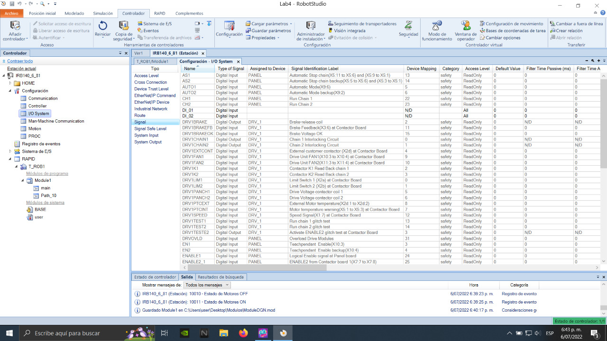

<h1 align="center"; style="text-align:center;">Laboratorio 5: Robótica Industrial No. 2</h1>
<p align="center";style="font-size:50px; background-color:pink; color:red; text-align:center;line-height : 60px; margin : 0; padding : 0;">
Robótica</p1>
<p align="center";style="font-size:50px; text-align:center; line-height : 40px;  margin-top : 0; margin-bottom : 0; "> <br> Giovanni Andrés Páez Ujueta</p>
<p align="center";style="font-size:50px; text-align:center; line-height : 20px; margin-top : 0; "> email: gpaezu@unal.edu.co</p>
<p align="center"; style="font-size:50px; text-align:center; line-height : 40px;  margin-top : 0; margin-bottom : 0; "> <br> Daniel Esteban Bohórquez Cifuentes</p>
<p align="center"; style="font-size:50px; text-align:center; line-height : 20px; margin-top : 0; "> email: dbohorquezc@unal.edu.co</p>
<p align="center"; style="font-size:50px; text-align:center; line-height : 40px;  margin-top : 0; margin-bottom : 0; "> <br> Nicolas Pulido Gerena</p>
<p align="center"; style="font-size:50px; text-align:center; line-height : 20px; margin-top : 0; "> email: npulido@unal.edu.co</p>
<p align="center"; style="font-size:50px; text-align:center; line-height : 30px;  margin-top : 0; margin-bottom : 0; "> <br><br>INGENIERÍA MECATRÓNICA</p>
<p align="center"; style="font-size:50px; text-align:center; line-height : 30px; margin-top : 0; "> Facultad de Ingeniería</p>
<p align="center"; style="font-size:50px; text-align:center; line-height : 30px; margin-top : 0; "> Universidad Nacional de Colombia Sede Bogotá</p>
<br>
<p align="center">
  
</p>

<p align="center"; style="font-size:50px; text-align:center; line-height : 30px; margin-top : 0; "> <br>06 de julio de 2022</p>

## Resumen

Este repositorio presenta el desarrollo de la practica 5 del laboratorio de Robótica, el cual en base a lo desarrollado a la [practica 4 de laboratorio](https://github.com/npulidog/lab_4_robotica-2022I) donde haciendo uso del manipulador industrial ABB IRB140 se desarrollaba de una rutina que dibuje las iniciales de cada uno de los integrantes del grupo (DGN), se hace uso de diferentes señales de entrada se controla y seleccionan diferentes formas de realizar la rutina con el manipulador (con un plano inclinado o un plano horizontal). Tambien se hace uso de las señales de entrada para realizar pick-n-place con diferentes objetos utilizando un gripper electroneumatico. 

## Entradas digitales

En la [practica 4 de laboratorio](https://github.com/npulidog/lab_4_robotica-2022I) se desarrollaron dos módulos en RAPID donde se indicaban las trayectorias necesarias para que el manipulador dibujara las iniciales de cada uno de los integrantes del grupo (DGN) en un area determinada de trabajo utlizando un marcador; un modulo para un plano horizontal y el otro para un plano inclinado de 30°.

Estos modulos RAPID se cargaban directamente en el Teach Pendant del manipulador e iniciaba inmediatamente la rutina de trabajo. Con fin de optimizar y automatizar procesos con el manipulador, se hace un modulo RAPID que permita la ejecución de las trayectorias mencionadas mediante el uso de dos botones diferentes.

La creación de las señales de entrada se hace con el software de RobotStudio, en la opción "Configuración - I/O System". Se crean dos señales llamadas DI_01 y DI_02, la primera para el plano horizontal y la segunda para el plano inclinado.

<p align="center">

</p>

Se importa el modulo RAPID y se edita siguiendo una logica donde se ejecuta un loop donde se espera que se presione algún botón y luego de presionado se ejecuta la rutina deseada por el manipulador. A continuación se ve el codigo RAPID:

```
MODULE Module1
    TASK PERS wobjdata Workobject_1:=[FALSE,TRUE,"",[[0,0,0],[1,0,0,0]],[[0,0,0],[1,0,0,0]]];
    PERS tooldata tool_dng:=[TRUE,[[49.0715,4.0023,101.477],[0.539093039,0.758125055,0.212630016,0.299021022]],[0.1,[49.0715,4.0023,101.477],[1,0,0,0],0,0,0]];
    CONST robtarget Home:=[[569.637561146,4.0023,586.264334398],[0.085403525,0.638022329,0.573183275,-0.507045046],[-1,0,-1,0],[9E+09,9E+09,9E+09,9E+09,9E+09,9E+09]];
    CONST robtarget Home_Approach:=[[420,610,50],[0.085405435,0.638022441,0.573183459,-0.507044375],[0,-2,1,0],[9E+09,9E+09,9E+09,9E+09,9E+09,9E+09]];
    CONST robtarget Target_10_D1:=[[420,610,0],[0.08540352,0.638022322,0.573183367,-0.507044952],[0,-2,1,0],[9E+09,9E+09,9E+09,9E+09,9E+09,9E+09]];
    CONST robtarget Target_10_D2:=[[570,610,0],[0.08540352,0.638022322,0.573183367,-0.507044952],[0,-2,1,0],[9E+09,9E+09,9E+09,9E+09,9E+09,9E+09]];
    CONST robtarget Target_10_D3:=[[495,510,0],[0.08540352,0.638022322,0.573183367,-0.507044952],[0,-2,1,0],[9E+09,9E+09,9E+09,9E+09,9E+09,9E+09]];
    CONST robtarget Target_10_G1_Approach:=[[495,465,50],[0.085405435,0.638022441,0.573183459,-0.507044375],[0,-2,1,0],[9E+09,9E+09,9E+09,9E+09,9E+09,9E+09]];
    CONST robtarget Target_10_G2:=[[495,465,0],[0.085405435,0.638022441,0.573183459,-0.507044375],[0,-2,1,0],[9E+09,9E+09,9E+09,9E+09,9E+09,9E+09]];
    CONST robtarget Target_10_G3:=[[495,390,0],[0.085405435,0.638022441,0.573183459,-0.507044375],[0,-2,1,0],[9E+09,9E+09,9E+09,9E+09,9E+09,9E+09]];
    CONST robtarget Target_10_G4:=[[420,390,0],[0.085405435,0.638022441,0.573183459,-0.507044375],[0,-2,1,0],[9E+09,9E+09,9E+09,9E+09,9E+09,9E+09]];
    CONST robtarget Target_10_G5:=[[495,490,0],[0.085405435,0.638022441,0.573183459,-0.507044375],[0,-2,1,0],[9E+09,9E+09,9E+09,9E+09,9E+09,9E+09]];
    CONST robtarget Target_10_G6:=[[570,390,0],[0.085405435,0.638022441,0.573183459,-0.507044375],[0,-2,1,0],[9E+09,9E+09,9E+09,9E+09,9E+09,9E+09]];
    CONST robtarget Target_10_G6A:=[[570,390,50],[0.085405435,0.638022441,0.573183459,-0.507044375],[0,-2,1,0],[9E+09,9E+09,9E+09,9E+09,9E+09,9E+09]];
    CONST robtarget Target_10_N1_Approach:=[[420,370,50],[0.085405435,0.638022441,0.573183459,-0.507044375],[0,-2,1,0],[9E+09,9E+09,9E+09,9E+09,9E+09,9E+09]];
    CONST robtarget Target_10_N2:=[[420,370,0],[0.085405435,0.638022441,0.573183459,-0.507044375],[0,-2,1,0],[9E+09,9E+09,9E+09,9E+09,9E+09,9E+09]];
    CONST robtarget Target_10_N3:=[[570,370,0],[0.085405435,0.638022441,0.573183459,-0.507044375],[0,-2,1,0],[9E+09,9E+09,9E+09,9E+09,9E+09,9E+09]];
    CONST robtarget Target_10_N4:=[[420,270,0],[0.085405435,0.638022441,0.573183459,-0.507044375],[0,-2,1,0],[9E+09,9E+09,9E+09,9E+09,9E+09,9E+09]];
    CONST robtarget Target_10_N5:=[[570,270,0],[0.085405435,0.638022441,0.573183459,-0.507044375],[0,-2,1,0],[9E+09,9E+09,9E+09,9E+09,9E+09,9E+09]];
    CONST robtarget Home2:=[[-76.744087791,319.637560578,689.720957177],[0.182983889,-0.032879857,0.935694426,-0.299852885],[-1,0,-1,0],[9E+09,9E+09,9E+09,9E+09,9E+09,9E+09]];
    CONST robtarget Home_Approach_3:=[[120,370,50],[0.085405435,0.638022441,0.573183459,-0.507044375],[-1,-2,1,0],[9E+09,9E+09,9E+09,9E+09,9E+09,9E+09]];
    CONST robtarget Target_10_D1_3:=[[120,370,0],[0.08540352,0.638022322,0.573183367,-0.507044952],[-1,-2,1,0],[9E+09,9E+09,9E+09,9E+09,9E+09,9E+09]];
    CONST robtarget Target_10_D2_3:=[[270,370,0],[0.08540352,0.638022322,0.573183367,-0.507044952],[-1,-2,1,0],[9E+09,9E+09,9E+09,9E+09,9E+09,9E+09]];
    CONST robtarget Target_10_D3_2:=[[195,270,0],[0.08540352,0.638022322,0.573183367,-0.507044952],[-1,-2,1,0],[9E+09,9E+09,9E+09,9E+09,9E+09,9E+09]];
    CONST robtarget Target_10_G1_Approach_2:=[[195,225,50],[0.085405435,0.638022441,0.573183459,-0.507044375],[-1,-2,1,0],[9E+09,9E+09,9E+09,9E+09,9E+09,9E+09]];
    CONST robtarget Target_10_G2_2:=[[195,225,0],[0.085405435,0.638022441,0.573183459,-0.507044375],[-1,-2,1,0],[9E+09,9E+09,9E+09,9E+09,9E+09,9E+09]];
    CONST robtarget Target_10_G3_2:=[[195,150,0],[0.085405435,0.638022441,0.573183459,-0.507044375],[-1,-2,1,0],[9E+09,9E+09,9E+09,9E+09,9E+09,9E+09]];
    CONST robtarget Target_10_G4_2:=[[120,150,0],[0.085405435,0.638022441,0.573183459,-0.507044375],[-1,-2,1,0],[9E+09,9E+09,9E+09,9E+09,9E+09,9E+09]];
    CONST robtarget Target_10_G5_2:=[[195,250,0],[0.085405435,0.638022441,0.573183459,-0.507044375],[-1,-2,1,0],[9E+09,9E+09,9E+09,9E+09,9E+09,9E+09]];
    CONST robtarget Target_10_G6_2:=[[270,150,0],[0.085405435,0.638022441,0.573183459,-0.507044375],[-1,-2,1,0],[9E+09,9E+09,9E+09,9E+09,9E+09,9E+09]];
    CONST robtarget Target_10_G6A_2:=[[270,150,50],[0.085405435,0.638022441,0.573183459,-0.507044375],[-1,-2,1,0],[9E+09,9E+09,9E+09,9E+09,9E+09,9E+09]];
    CONST robtarget Target_10_N1_Approach_2:=[[120,130,50],[0.085405435,0.638022441,0.573183459,-0.507044375],[-1,-2,1,0],[9E+09,9E+09,9E+09,9E+09,9E+09,9E+09]];
    CONST robtarget Target_10_N2_2:=[[120,130,0],[0.085405435,0.638022441,0.573183459,-0.507044375],[-1,-2,1,0],[9E+09,9E+09,9E+09,9E+09,9E+09,9E+09]];
    CONST robtarget Target_10_N3_2:=[[270,130,0],[0.085405435,0.638022441,0.573183459,-0.507044375],[-1,-2,1,0],[9E+09,9E+09,9E+09,9E+09,9E+09,9E+09]];
    CONST robtarget Target_10_N4_2:=[[120,30,0],[0.085405435,0.638022441,0.573183459,-0.507044375],[-1,-2,1,0],[9E+09,9E+09,9E+09,9E+09,9E+09,9E+09]];
    CONST robtarget Target_10_N5_2:=[[270,30,0],[0.085405435,0.638022441,0.573183459,-0.507044375],[-1,-2,1,0],[9E+09,9E+09,9E+09,9E+09,9E+09,9E+09]];
    PERS wobjdata Rotada_30G:=[FALSE,TRUE,"",[[500,-540,0],[0.965925826,0,-0.258819045,0]],[[-202.846096912,132.679491932,148.660254029],[0.707106781,-0.353553391,0,-0.612372436]]];
    CONST robtarget Target_10_N5_Approach_2:=[[270,30,50],[0.085405435,0.638022441,0.573183459,-0.507044375],[-1,-2,1,0],[9E+09,9E+09,9E+09,9E+09,9E+09,9E+09]];
    PROC main()
        TPWrite("Inicio");
        WaitTime(1);
       IF DI_01=1 THEN
            MoveJ Home,v200,z5,tool_dng\WObj:=Workobject_1;
            MoveJ Home_Approach,v200,z5,tool_dng\WObj:=Workobject_1;
            MoveL Target_10_D1,v100,z5,tool_dng\WObj:=Workobject_1;
            MoveL Target_10_D2,v150,z5,tool_dng\WObj:=Workobject_1;
            MoveC Target_10_D3,Target_10_D1,v150,z5,tool_dng\WObj:=Workobject_1;
            MoveJ Home_Approach,v200,z5,tool_dng\WObj:=Workobject_1;
            MoveJ Target_10_G1_Approach,v100,z5,tool_dng\WObj:=Workobject_1;
            MoveJ Target_10_G2,v100,z5,tool_dng\WObj:=Workobject_1;
            MoveJ Target_10_G3,v100,z5,tool_dng\WObj:=Workobject_1;
            MoveJ Target_10_G4,v100,z5,tool_dng\WObj:=Workobject_1;
            MoveC Target_10_G5,Target_10_G6,v100,z5,tool_dng\WObj:=Workobject_1;
            MoveJ Target_10_G6A,v100,z5,tool_dng\WObj:=Workobject_1;
            MoveJ Target_10_N1_Approach,v100,z5,tool_dng\WObj:=Workobject_1;
            MoveJ Target_10_N2,v100,z5,tool_dng\WObj:=Workobject_1;
            MoveJ Target_10_N3,v100,z5,tool_dng\WObj:=Workobject_1;
            MoveJ Target_10_N4,v100,z5,tool_dng\WObj:=Workobject_1;
            MoveJ Target_10_N5,v100,z5,tool_dng\WObj:=Workobject_1;
            MoveJ Home,v200,z5,tool_dng\WObj:=Workobject_1;
       ENDIF
       IF DI_02=1 THEN
           Path_10;
       ENDIF
    ENDPROC
    PROC Path_10()
        MoveJ Home2,v100,z5,tool_dng\WObj:=Rotada_30G;
        MoveJ Home_Approach_3,v100,z5,tool_dng\WObj:=Rotada_30G;
        MoveJ Target_10_D1_3,v100,z5,tool_dng\WObj:=Rotada_30G;
        MoveJ Target_10_D2_3,v100,z5,tool_dng\WObj:=Rotada_30G;
        MoveC Target_10_D3_2,Target_10_D1_3,v100,z5,tool_dng\WObj:=Rotada_30G;
        MoveJ Target_10_G1_Approach_2,v100,z5,tool_dng\WObj:=Rotada_30G;
        MoveJ Target_10_G2_2,v100,z5,tool_dng\WObj:=Rotada_30G;
        MoveJ Target_10_G3_2,v100,z5,tool_dng\WObj:=Rotada_30G;
        MoveJ Target_10_G4_2,v100,z5,tool_dng\WObj:=Rotada_30G;
        MoveC Target_10_G5_2,Target_10_G6_2,v100,z5,tool_dng\WObj:=Rotada_30G;
        MoveJ Target_10_G6A_2,v100,z5,tool_dng\WObj:=Rotada_30G;
        MoveJ Target_10_N1_Approach_2,v100,z5,tool_dng\WObj:=Rotada_30G;
        MoveJ Target_10_N2_2,v100,z5,tool_dng\WObj:=Rotada_30G;
        MoveJ Target_10_N3_2,v100,z5,tool_dng\WObj:=Rotada_30G;
        MoveJ Target_10_N4_2,v100,z5,tool_dng\WObj:=Rotada_30G;
        MoveJ Target_10_N5_2,v100,z5,tool_dng\WObj:=Rotada_30G;
        MoveJ Target_10_N5_Approach_2,v100,z5,tool_dng\WObj:=Rotada_30G;
        MoveJ Home2,v100,z5,tool_dng\WObj:=Rotada_30G;
    ENDPROC
    
ENDMODULE
```
## Video

La implementación fisica se puede ver en el siguiente [video](https://youtu.be/I4B5uM2rMkM)

## Conclusiones
- El uso de entradas y salidas digitales es importante para establecer la capacidad real de un manipulador en situaciones industriales reales, puesto que define las rutinas y las configuraciones del manipulador de manera mas eficiente optimizando tiempo de cambio entre rutinas y trayectorias.
